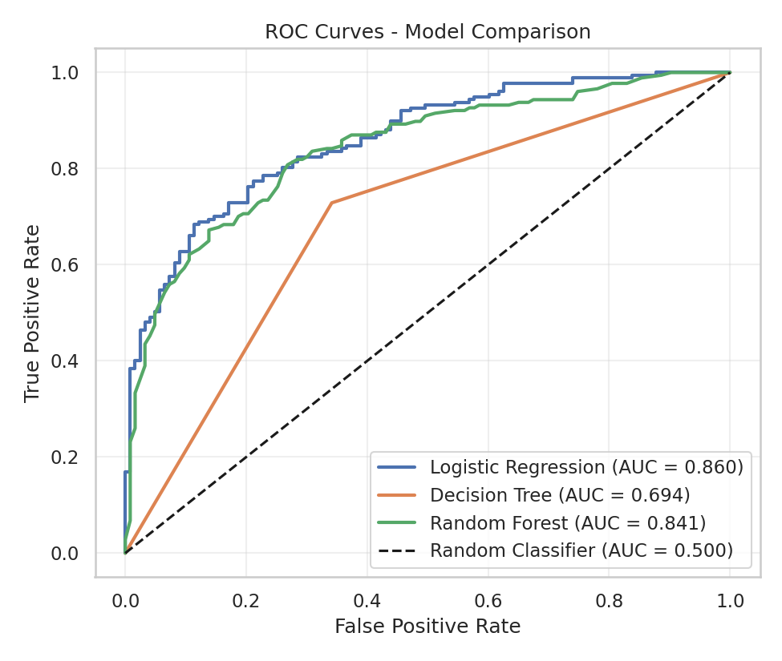
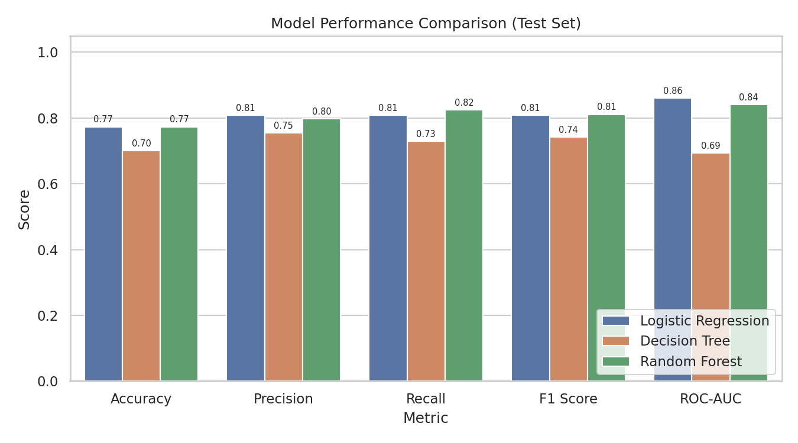
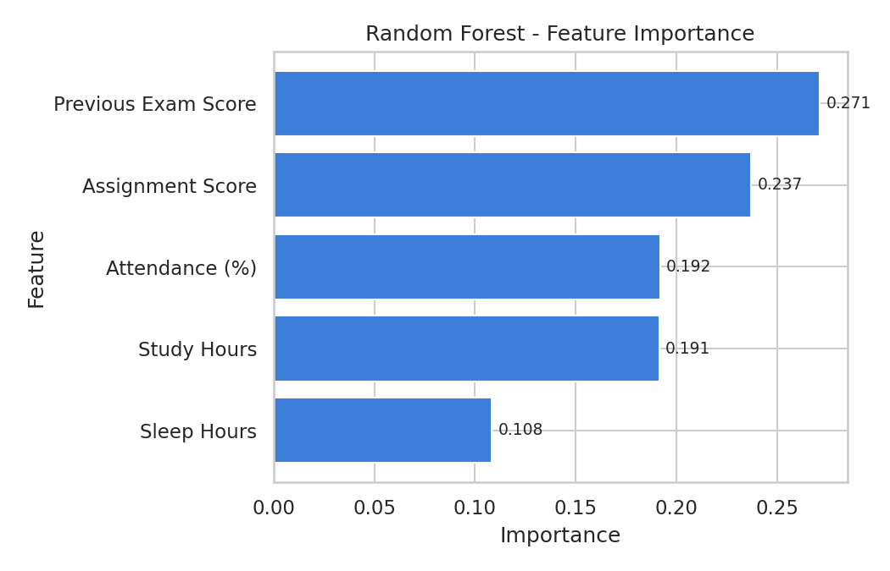

# Project Report: Student Performance Prediction Using Machine Learning

## 1. Abstract
This project builds a supervised machine-learning system that predicts whether a student will pass or fail from study hours, attendance, previous exam score, assignment score and sleep hours. Three classifiers (Logistic Regression, Decision Tree, Random Forest) were trained on 1200 records and tested on 300 unseen records. On the test set, Logistic Regression achieved the best ROC-AUC (0.8604) with accuracy 77.33%, Random Forest reached ROC-AUC 0.8414 and the Decision Tree 0.6937. The best model is saved and used in a Streamlit web application.

## 2. Introduction
Machine learning lets computers learn patterns from data. In education, early prediction of poor results helps teachers support students in time. This project applies supervised learning and standard evaluation tools (confusion matrix, ROC curve).

## 3. Problem Statement
Predict the binary outcome (Pass = 1, Fail = 0) of a student from academic and lifestyle features.

## 4. Objectives
1. Apply Logistic Regression, Decision Tree and Random Forest.
2. Train and test the models and compare their accuracy.
3. Visualise performance with confusion matrices and ROC curves.
4. Build a simple application for predicting on new students.

## 5. Existing System
Traditionally, teachers judge student risk manually from marks and attendance. This is subjective, slow and cannot weigh many factors together.

## 6. Proposed System
An ML system that learns the relation between student features and results from data, gives a Pass/Fail prediction with a probability, and reports measurable performance.

## 7. Dataset
1500 synthetic records generated with a fixed seed (42) by `src/data_generation.py`, saved as `data/student_performance.csv`. Features: study_hours, attendance, previous_score, assignment_score, sleep_hours; target: result (1 = Pass, 0 = Fail). The target is created from a noisy logistic function of the features, so it is related to them but not perfectly predictable. The pass rate is 59% (885 pass, 615 fail). Because the data is synthetic, conclusions apply to the workflow, not to real students.

## 8. Data Preprocessing
Dataset shape, head, data types, missing values and duplicates were checked: 0 missing values and 0 duplicates were found. The code still handles them (median fill, drop duplicates). Features X and target y were separated and split 80/20 with `random_state=42` and `stratify=y` (1200 train / 300 test). The StandardScaler for Logistic Regression is inside a scikit-learn Pipeline, so it is fitted on the training data only (no data leakage).

## 9. Exploratory Data Analysis
Graphs in `outputs/figures/`: Pass/Fail distribution (59% pass), box plots of study hours, attendance and previous score against result, and a correlation heatmap. Correlation of each feature with result: previous score 0.43, assignment score 0.39, study hours 0.35, attendance 0.31, sleep hours 0.10. Passing students tend to have higher values for all features.

## 10. Machine Learning Algorithms
- **Logistic Regression:** linear model that outputs the probability of passing using a sigmoid function. Simple, fast, interpretable. (Linear Regression predicts continuous values, so it is not suited to Pass/Fail.)
- **Decision Tree:** a flowchart of if-else questions on features. Easy to understand but prone to overfitting.
- **Random Forest:** 100 decision trees trained on random samples; predictions are combined by voting. Reduces overfitting.

## 11. System Architecture
Data generation -> Preprocessing and EDA -> Train/test split -> Model training (3 pipelines) -> Evaluation on test set -> Automatic best-model selection -> Save with joblib -> Streamlit app loads the model for predictions and shows the dashboard.

## 12. Model Training
Each model was fitted on the 1200 training records. Settings: Logistic Regression (`max_iter=1000`), Decision Tree (`random_state=42`), Random Forest (`n_estimators=100`, `random_state=42`). No hyperparameter tuning was done, to keep the project simple.

## 13. Evaluation Metrics
Accuracy = correct predictions / all predictions. Precision = TP/(TP+FP). Recall = TP/(TP+FN). F1 = harmonic mean of precision and recall. ROC-AUC = area under the ROC curve (0.5 = random, 1.0 = perfect). All are calculated on the test set.

## 14. Results
| Model | Accuracy | Precision | Recall | F1 Score | ROC-AUC |
|---|---|---|---|---|---|
| Logistic Regression | 0.7733 | 0.8079 | 0.8079 | 0.8079 | 0.8604 |
| Decision Tree | 0.7000 | 0.7544 | 0.7288 | 0.7414 | 0.6937 |
| Random Forest | 0.7733 | 0.7978 | 0.8249 | 0.8111 | 0.8414 |

## 15. Model Comparison
Logistic Regression and Random Forest have the same accuracy (77.33%). Logistic Regression has the highest ROC-AUC (0.8604), so it is selected automatically. Random Forest has a slightly higher F1 (0.8111 vs 0.8079), but its AUC is lower by 0.019, which is beyond the 0.005 tie tolerance, so AUC decides. The Decision Tree scored 100% on training data but only 70% on test data: it overfits. Logistic Regression suits this data because the underlying relationship is mostly linear.

## 16. Confusion Matrix Analysis
Test set (300 students: 123 fail, 177 pass):
| Model | TN | FP | FN | TP |
|---|---|---|---|---|
| Logistic Regression | 89 | 34 | 34 | 143 |
| Decision Tree | 81 | 42 | 48 | 129 |
| Random Forest | 86 | 37 | 31 | 146 |

Random Forest misses the fewest passing students (31 false negatives); Logistic Regression has the most correct fail predictions (89 true negatives).

## 17. ROC Curve Analysis
`outputs/figures/roc_curve.png` shows all models against the random-classifier diagonal. Logistic Regression (AUC 0.860) and Random Forest (0.841) curves are close and far above the diagonal; the Decision Tree (0.694) is much lower because a single tree gives only a few probability values.

## 18. Feature Importance
Random Forest importances: Previous Exam Score 0.271, Assignment Score 0.237, Attendance 0.192, Study Hours 0.191, Sleep Hours 0.108. Sleep hours matters least, matching how the data was generated and the correlation values.

## 19. Visualizations
All figures are produced by `python src/train_model.py` and stored in `outputs/figures/`.

| Figure | File |
|---|---|
| Pass vs Fail distribution | `pass_fail_distribution.png` |
| Study hours vs result | `study_hours_vs_result.png` |
| Attendance vs result | `attendance_vs_result.png` |
| Previous score vs result | `previous_score_vs_result.png` |
| Correlation heatmap | `correlation_heatmap.png` |
| Confusion matrices (3 models) | `confusion_matrix_*.png` |
| ROC curves (all models) | `roc_curve.png` |
| Model comparison chart | `model_comparison.png` |
| Random Forest feature importance | `random_forest_feature_importance.png` |

## 20. Prediction Demonstration
Using the saved model (`python src/predict.py`): strong student (7 h, 92%, 85, 88, 7.5 h) -> PASS, P(pass) 99.9%; average student (4 h, 72%, 60, 65, 7 h) -> PASS, 69.3%; weak student (1 h, 45%, 35, 40, 5 h) -> FAIL, 0.3%. The Streamlit app shows the same real `predict_proba` output.

## 21. Advantages
Simple and fast; reproducible; leak-free; shows probabilities; runs fully offline; easy-to-use interface.

## 22. Limitations
- Data is synthetic; real students are more complex.
- Only five features; accuracy about 77% on test data.
- No hyperparameter tuning or cross-validation.
- A single 80/20 split, so results can vary with a different split.
- The model should support teachers, not replace their judgement.

## 23. Future Scope
Real data, cross-validation and GridSearchCV, more features and models, regression for marks prediction, cloud deployment.

## 24. Conclusion
The project completes a full supervised-learning workflow. Logistic Regression was the best model on the test set (ROC-AUC 0.8604, accuracy 77.33%), while the Decision Tree showed clear overfitting. The final Streamlit application predicts Pass/Fail for new students using the saved model.

## 25. References
- scikit-learn documentation: https://scikit-learn.org/stable/
- Streamlit documentation: https://docs.streamlit.io/
- pandas documentation: https://pandas.pydata.org/docs/
- matplotlib documentation: https://matplotlib.org/stable/
- seaborn documentation: https://seaborn.pydata.org/
