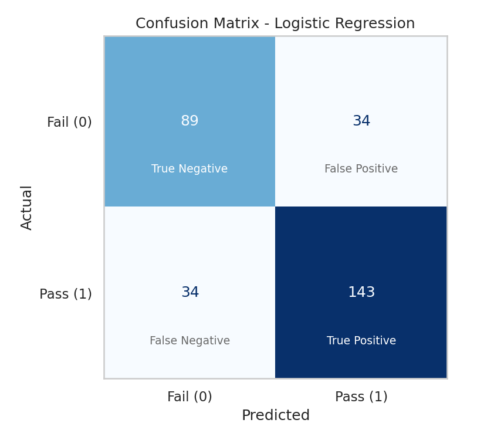

# Predictive Modeling Using Machine Learning

A supervised machine-learning project that predicts whether a student will **PASS (1)** or **FAIL (0)** from five performance-related features, with model comparison, evaluation plots and a Streamlit web app.

## 1. Project Overview
The project trains and compares three classification algorithms (Logistic Regression, Decision Tree, Random Forest) on a student-performance dataset. All metrics are computed on a held-out test set, the best model is selected automatically, saved with `joblib`, and used by a Streamlit app for predictions on new students.

## 2. Problem Statement
Given a student's study hours, attendance, previous exam score, assignment score and sleep hours, predict the academic outcome (PASS/FAIL) so that students at risk can be identified early.

## 3. Objectives
- Apply Logistic Regression, Decision Tree and Random Forest to a classification task
- Train and test the models and measure their performance
- Visualise performance with confusion matrices and ROC curves
- Gain experience in supervised learning and model evaluation

## 4. Features
- Reproducible dataset generation (fixed random seed 42)
- Data checks (shape, types, missing values, duplicates) and exploratory data analysis
- Leak-free preprocessing: the scaler is part of a scikit-learn `Pipeline`
- Metrics: accuracy, precision, recall, F1-score, ROC-AUC (test set only)
- Confusion matrix for each model, combined ROC curve, comparison chart, Random Forest feature importance
- Automatic best-model selection (highest ROC-AUC, F1-score as tie-breaker)
- Streamlit app with a prediction page and a model-performance dashboard

## 5. Dataset Description
`data/student_performance.csv` contains **1500 records** and 6 columns. It is **synthetic**: it is generated by `src/data_generation.py` (seed 42) from a noisy logistic relationship between the features and the result, so the label is learnable but not perfectly predictable. The overall pass rate is 59%.

| Column | Description | Range |
|---|---|---|
| `study_hours` | Daily study hours | 0 - 10 |
| `attendance` | Attendance percentage | 33 - 100 |
| `previous_score` | Previous exam score | 17.9 - 100 |
| `assignment_score` | Assignment score | 1.6 - 100 |
| `sleep_hours` | Daily sleep hours | 3.1 - 10 |
| `result` | **Target**: 1 = PASS, 0 = FAIL | 0 / 1 |

> Because the data is synthetic, the results demonstrate the machine-learning workflow and should not be read as findings about real students.

## 6. Machine Learning Algorithms
| Algorithm | Notes |
|---|---|
| Logistic Regression | Linear model that outputs the probability of passing; features are standardised with `StandardScaler` inside a Pipeline |
| Decision Tree | `DecisionTreeClassifier(random_state=42)`; easy to interpret, tends to overfit |
| Random Forest | `RandomForestClassifier(n_estimators=100, random_state=42)`; many trees voting together |

**Why Logistic Regression and not Linear Regression?** The target is categorical (PASS/FAIL), so this is a classification problem. Logistic Regression is designed for categorical targets and outputs probabilities between 0 and 1, whereas Linear Regression is designed for continuous numerical targets (such as predicting an exact mark).

## 7. Data Preprocessing
1. Load the dataset and display shape, first rows and data types
2. Check missing values (none found) and duplicates (none found); the code handles both if present
3. Separate features `X` and target `y`
4. Stratified train/test split: `test_size=0.20`, `random_state=42` (1200 training / 300 test records)
5. Scaling (Logistic Regression only) is fitted on training data inside a Pipeline, which prevents data leakage

## 8. Model Training
`python src/train_model.py` runs the whole workflow: cleaning, EDA graphs, split, training of the three pipelines, evaluation, graph generation, best-model selection and saving. Every model is a `Pipeline`, so the saved file contains its own preprocessing and the app can send raw feature values.

## 9. Model Evaluation
Metrics are calculated on the unseen 20% test set: accuracy, precision, recall, F1-score and ROC-AUC, plus a confusion matrix per model and a combined ROC curve. The best model is the one with the highest ROC-AUC (models within 0.005 AUC of the top are ranked by F1-score).

## 10. Results
Values below come from `outputs/model_comparison.csv`:

| Model | Accuracy | Precision | Recall | F1 Score | ROC-AUC |
|---|---|---|---|---|---|
| Logistic Regression | 0.7733 | 0.8079 | 0.8079 | 0.8079 | 0.8604 |
| Decision Tree | 0.7000 | 0.7544 | 0.7288 | 0.7414 | 0.6937 |
| Random Forest | 0.7733 | 0.7978 | 0.8249 | 0.8111 | 0.8414 |

**Best model: Logistic Regression** (ROC-AUC 0.8604, accuracy 0.7733, F1 0.8079). Random Forest is close behind. The Decision Tree overfits: on this split it scores 100% on the training data but only 70% on the test data. On this mostly linear synthetic data, a simple model performs best.

## 11. Visualizations
| ROC curves | Model comparison |
|---|---|
|  |  |

| Confusion matrix (best model) | Random Forest feature importance |
|---|---|
|  |  |

Further figures are in [`outputs/figures/`](outputs/figures/): confusion matrices for the other two models, Pass/Fail distribution, study hours / attendance / previous score vs result, and the correlation heatmap.

## 12. Streamlit Application
`app.py` loads `models/best_model.joblib` (it does not retrain). The sidebar takes the five student inputs; **Predict Result** shows PASS or FAIL with the model's probability of passing (from `predict_proba`). A second tab shows the model comparison table, metrics of the best model, confusion matrices, ROC curve, feature importance and EDA graphs.

## 13. Project Structure
```
predictive-modeling-ml/
├── app.py                      # Streamlit application
├── requirements.txt
├── README.md
├── PROJECT_REPORT.md
├── VIVA_QUESTIONS.md
├── LICENSE
├── .gitignore
├── data/
│   └── student_performance.csv
├── models/
│   ├── best_model.joblib
│   └── model_metadata.json
├── src/
│   ├── __init__.py
│   ├── config.py               # project-relative paths and constants
│   ├── data_generation.py      # creates the dataset
│   ├── preprocessing.py        # load, clean, split, EDA graphs
│   ├── train_model.py          # train, evaluate, select and save best model
│   ├── evaluate_model.py       # metrics and plots
│   └── predict.py              # load model and predict
└── outputs/
    ├── model_comparison.csv
    └── figures/                # all generated graphs (PNG)
```

## 14. Installation
Requires Python 3.9 or newer.
```bash
git clone <YOUR_GITHUB_REPOSITORY_URL>
cd predictive-modeling-ml
python -m venv venv                 # optional but recommended
venv\Scripts\activate               # Windows   (Linux/macOS: source venv/bin/activate)
pip install -r requirements.txt
```

## 15. How to Run
The dataset, trained model and graphs are already included, so the app runs immediately:
```bash
streamlit run app.py
```
To regenerate everything from scratch (results are reproducible because all seeds are fixed):
```bash
python src/data_generation.py   # creates data/student_performance.csv
python src/train_model.py       # trains, evaluates, saves graphs and the best model
python src/predict.py           # optional: command-line prediction examples
```
If the app reports that the saved model cannot be loaded (this can happen with a very different scikit-learn version), run `python src/train_model.py` once to recreate it.

## 16. Example Prediction
Output of `python src/predict.py` using the saved model:
```
Strong student   (7, 92, 85, 88, 7.5) -> PASS (P(pass) = 99.9%)
Average student  (4, 72, 60, 65, 7) -> PASS (P(pass) = 69.3%)
Weak student     (1, 45, 35, 40, 5) -> FAIL (P(pass) = 0.3%)
```
Inputs are `(study_hours, attendance, previous_score, assignment_score, sleep_hours)`.

## 17. Technologies Used
Python, pandas, NumPy, scikit-learn, matplotlib, seaborn, joblib, Streamlit.

## 18. Future Improvements
- Use a real (anonymised) student dataset
- Cross-validation and hyperparameter tuning (e.g. `GridSearchCV`)
- Additional features and models (e.g. Gradient Boosting, SVM)
- Predicting exact marks with a regression model
- Deploying the app online

## 19. Author
[Your Name] - [Your College / Department] - [GitHub profile or email]

## 20. License
Released under the [MIT License](LICENSE).
